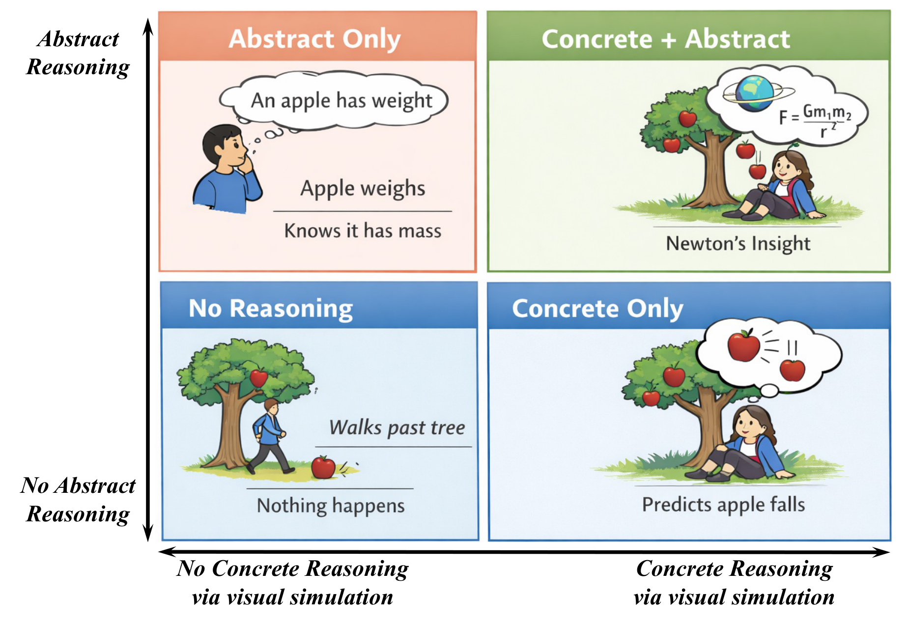
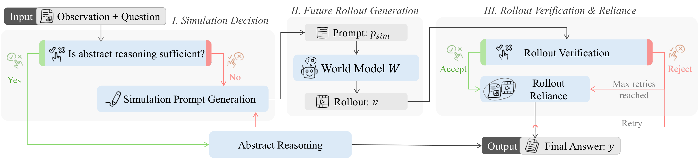

# World Models Meet Language Models: On the Complementarity of Concrete and Abstract Reasoning (EMNLP 2026)

<p align="center">
  <a href="https://arxiv.org/abs/2606.03603"></a>
  <a href="https://github.com/yczhou001/PF-OPSD"></a>
  <a href="https://huggingface.co/datasets/YCZhou/vrqa_bench"></a>
  <a href="https://huggingface.co/datasets/YCZhou/openworld_qa"></a>
  <a href="LICENSE"></a>
</p>

> **PF-OPSD** — Privileged-Future On-Policy Self-Distillation for controlled concrete reasoning in MLLMs.
<p align="center">
  
</p>

---

## Overview

World models and multimodal large language models (MLLMs) offer **complementary** capabilities for predicting future outcomes from static visual observations. World models generate *concrete* visual rollouts; MLLMs reason *abstractly* over goals, rules, and question semantics. However, rolling out a world model blindly does not help — generated rollouts are stochastic, may be visually plausible yet task-incorrect, and the model must learn *when* to invoke simulation, *whether* to trust a rollout, and *how* to integrate it with abstract reasoning.

<p align="center">
  
</p>

We call this problem **controlled concrete reasoning** and make three concrete contributions:

1. **VRQABench** — a benchmark for controllable spatial lookahead from maze and Sokoban puzzle images (4,636 questions). [🤗 Dataset](https://huggingface.co/datasets/YCZhou/vrqa_bench)
2. **OpenWorldQA** — a benchmark for open-domain physical future prediction from pre-event anchor frames in real-world videos (4,404 questions). [🤗 Dataset](https://huggingface.co/datasets/YCZhou/openworld_qa)
3. **PF-OPSD** — a training framework that uses ground-truth future videos as *teacher-side* privileged context, scores on-policy concrete-reasoning trajectories, and distills advantage-weighted targets back into a deployable student that has no access to true futures at test time.

---

## Installation

```bash
git clone https://github.com/yczhou001/PF-OPSD
cd PF-OPSD
pip install -r requirements.txt
```

Flash Attention 2 (recommended for training speed):

```bash
pip install flash-attn --no-build-isolation
```

Set required environment variables:

```bash
export OPENAI_API_KEY="your_api_key"
export OPENAI_API_BASE="https://api.openai.com/v1"  # or your endpoint
```

---

## Part 1 — OpenWorldQA Dataset Construction

OpenWorldQA is a benchmark for predicting real-world physical futures from pre-event anchor frames. It is built with a five-stage agentic pipeline applied to videos from Charades, SomethingV2, Oops, and CharadesEgo.

> 💡 The prebuilt benchmark is available on Hugging Face: [`YCZhou/openworld_qa`](https://huggingface.co/datasets/YCZhou/openworld_qa). The steps below are only needed to reconstruct it from scratch.

### Step 1a — Download raw videos

Download the following datasets and place them under `openworld_qa/raw_data/` (or set `RAW_DATA_ROOT`):

| Dataset | Suggested path |
|---------|---------------|
| [Something-Something V2](https://developer.qualcomm.com/software/ai-datasets/something-something) | `raw_data/sthv2/extracted/20bn-something-something-v2/` |
| [Charades](https://allenai.org/data/charades) | `raw_data/charades/Charades_v1_480/Charades_v1_480/` |
| [Oops](https://oops.cs.columbia.edu) | `raw_data/oops/oops_dataset/oops_video/train/` |
| [CharadesEgo](https://allenai.org/data/charades) | `raw_data/charades_ego/CharadesEgo_v1_480/` |

### Step 1b — Sample and extract frames

```bash
# Sample 5000 videos and extract frames (runs ffmpeg in parallel)
python openworld_qa/sample_and_extract.py \
    --total 5000 \
    --output_dir openworld_qa/output/frames \
    --num_workers 16

# Or extract frames from a specific video directory
python openworld_qa/extract_frames.py \
    --video_dir raw_data/charades/Charades_v1_480/Charades_v1_480/ \
    --output_dir openworld_qa/output/frames
```

### Step 1c — Run the 5-agent pipeline

```bash
export OPENAI_API_KEY="your_key"

python openworld_qa/pipeline.py \
    --frames_dir openworld_qa/output/frames/ \
    --output_dir openworld_qa/output/reviewed/ \
    --num_workers 3 \
    --save_rejections
```

The pipeline is **resumable** — re-running skips already-processed videos.

| Argument | Default | Description |
|----------|---------|-------------|
| `--frames_dir` | `output/frames/` | Input: frame directories |
| `--output_dir` | `output/reviewed/` | Output: accepted QA JSON files |
| `--num_workers` | `3` | Parallel workers |
| `--max_videos` | `0` (all) | Cap for testing |
| `--save_rejections` | off | Save rejected samples |
| `--save_generated` | off | Save intermediate outputs |

**Pipeline architecture (5 agents):**

```
All frames
    │
    ▼  Agent 1: SceneAnalyst  (all frames, multimodal)
       → structured scene report + anchor frame selection
    │
    ▼  Agent 2: QuestionDesigner  (text only)
       → 6 question skeletons across 12 physical categories
    │
    ▼  Agent 3: DistractorForge  (text only)
       → 6 complete QA drafts with physically plausible distractors
    │
    ▼  Agent 4: SmallModelProbe  (anchor frame, small model, ×2 shuffled)
       → "too_easy" → discard | "hard_enough" → keep
    │
    ▼  Agent 5: Reviewer  (anchor + post-anchor context frames)
       → 5-dimension review; score ≥ 7 → accept
```

### Step 1d — Evaluate a model

```bash
python openworld_qa/evaluate.py \
    --split test \
    --model gpt-5.4 \
    --num_workers 8
```

---

## Part 2 — VRQABench Dataset Construction

VRQABench tests controllable spatial lookahead from maze, irregular-maze, and Sokoban puzzle images. Labels are **programmatically verified** (BFS / geometric solver), and a VLM only writes question text.

> 💡 The prebuilt benchmark is available on Hugging Face: [`YCZhou/vrqa_bench`](https://huggingface.co/datasets/YCZhou/vrqa_bench). The steps below are only needed to reconstruct it from scratch.

### Step 2a — Get VR-Bench data

Download [VR-Bench](https://github.com/vrbench/vrbench) and place under `vrqa_bench/raw_data/`.

### Step 2b — Run the pipeline

```bash
export OPENAI_API_KEY="your_key"

# Evaluation split (hard difficulty)
python vrqa_bench/pipeline.py --split eval --num_workers 4

# Training split (hard + medium + easy, with quotas)
python vrqa_bench/pipeline.py --split train --num_workers 4
```

**Pipeline (4 steps):**

1. **Programmatic Solver** — BFS on maze, Sokoban search, geometric path analysis → verified answer + options
2. **QuestionWriter** (VLM) — writes natural-language question text only (no answer generation)
3. **SmallModelProbe** — filters trivially-easy items
4. **Reviewer** (VLM) — checks question text validity and distractor plausibility

### Step 2c — Evaluate a model

```bash
python vrqa_bench/scripts/evaluate.py --model gpt-5.4 --num_workers 8
```

### Step 2d — Shuffle options & pack training split

```bash
python vrqa_bench/scripts/shuffle_options.py    # randomise A/B/C/D order
python vrqa_bench/scripts/pack_train.py         # package into VRBench-Spatial-v2-train.tar.gz
```

---

## Part 3 — PF-OPSD Training

### World Model: Helios

PF-OPSD uses **Helios** as the generative video world model.

> **Helios repository:** https://github.com/helios-world-model/helios
>
> *Yuan et al., 2026 — "Helios: A Video World Model for Physical Future Simulation"*

| Variant | Used for |
|---------|----------|
| `helios-vrbench` | VRQABench experiments |
| `helios-general` | OpenWorldQA experiments |

Set up Helios and export:

```bash
export HELIOS_BASE_URL="http://your-helios-endpoint"
export HELIOS_API_KEY="your-helios-key"
```

For offline testing without Helios, use `--world_model_type stub`.

### Step 3a — Generate Stage-1 Privileged Trajectories

```bash
python -m trajectory_gen.pipeline \
    --benchmark openworldqa \
    --world_model_type helios \
    --teacher_model gemini-3.1-pro \
    --num_workers 4 \
    --output_dir trajectory_gen/output/trajectories
```

The teacher VLM observes ground-truth future frames (*v\**) and correct answer (*y\**), then generates labelled training trajectories `d_sim → p_sim → z_ver → z_rel → y`.

| Argument | Default | Description |
|----------|---------|-------------|
| `--benchmark` | `all` | `openworldqa` \| `vrqabench` \| `all` |
| `--teacher_model` | `gemini-3.1-pro` | Teacher VLM |
| `--world_model_type` | `stub` | `stub` \| `helios` |
| `--max_samples` | `0` (all) | Cap for quick tests |
| `--dry_run` | off | Print plan, no API calls |

### Step 3b — Stage 1: Protocol SFT

```bash
bash train/scripts/run_sft.sh
```

Paper hyperparameters (`train/configs/sft.yaml`)

### Step 3c — Stage 2: PF-OPSD On-Policy Self-Distillation

Configure `train/configs/pfopsd.yaml`:

```yaml
evaluator_model:   "Qwen3.6-27B"
evaluator_base_url: ""          # or set $OPENAI_API_BASE
world_model_type:  "helios"
helios_base_url:   ""           # or set $HELIOS_BASE_URL
helios_model:      "helios-vrbench"
```

Then run:

```bash
bash train/scripts/run_pfopsd.sh 4   # requires Stage 1 checkpoint
```

Paper hyperparameters (`train/configs/pfopsd.yaml`)

---

## Environment Variables

| Variable | Description | Default |
|----------|-------------|---------|
| `OPENAI_API_KEY` | API key for all VLM calls | — (required) |
| `OPENAI_API_BASE` | OpenAI-compatible endpoint | `https://api.openai.com/v1` |
| `HELIOS_BASE_URL` | Helios world model endpoint | — |
| `HELIOS_API_KEY` | Helios auth token | — |
| `VRB_DATA_ROOT` | VRQABench data root | `<repo>/vrqa_bench/raw_data` |
| `RAW_DATA_ROOT` | OpenWorldQA raw video root | `openworld_qa/raw_data` |
| `CONDA_ENV` | Conda env for training scripts | (current env) |

---

## Citation

```bibtex
@misc{zhou2026worldmodelsmeetlanguage,
      title={World Models Meet Language Models: On the Complementarity of Concrete and Abstract Reasoning}, 
      author={Yucheng Zhou and Wei Tao and Yiwen Guo and Jianbing Shen},
      year={2026},
      eprint={2606.03603},
      archivePrefix={arXiv},
      primaryClass={cs.CV},
      url={https://arxiv.org/abs/2606.03603}, 
}
```

## License

This project is licensed under the MIT License.
